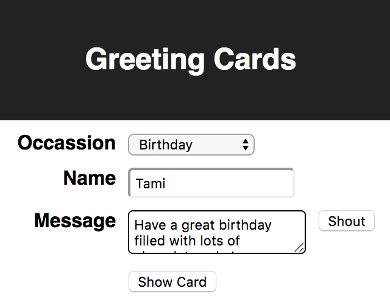

# Web App State Management

There are many approaches to managing state (data) in web applications.
Often state management libraries are specific to a single framework
such as Angular, React, or Vue.

State can be stored in any of these locations:
* the DOM
* sessionStorage
* localStorage
* inside components that use the state
* a "store" that can be shared by all components

The last option has become the most popular.
One reason for this is the desire for state changes
to be reflected by re-rendering all components
that care about particular pieces of data.
An example of a library that provides this functionality
is Redux. It can be used with many frameworks
and is especially popular in React applications.

## Goals

Goals for state management include:

1. Enable writing components that can just render
   data passed to them (in React using "props").
2. It should be easy to specify the state properties
   used by each component whose changes
   should cause a component to re-render.
4. It should be easy to replace the current state with new state.
5. It should be easy to retrieve the current state.
3. It should be easy to write and register functions
   that derive a new state by applying changes to the current state
   and such functions should be usable by multiple components.
6. It should be easy to view the current and past states
   in browser developer tools.
7. It should be easy to see a log of all requested state changes
   and the diffs they caused.
8. It should be easy to replay state changes backward and forward
   and see resulting UI changes ("time travel debugging").
9. State should survive browser refreshes and
   the UI should re-render correctly.

The only approach for storing state that was listed earlier
that can meet these goals is using a store.
Many state management libraries support using a store,
but most do not achieve all the listed goals.

## Redux Fundamentals

The Redux approach to state management can be summarized by the following:

* Application state is held in a single "store".
* State is only updated by dispatching actions.
* Actions are objects that have a type and optional payload.
* Actions can be dispatched by any code,
  but often this is done by components
  in response to user interaction
* Reducers are functions that take the current state and an action,
  and return a new state.
* State is never modified, only replaced.
* Components can register to be notified
  when state they care about changes
  so they can re-render.

## Example Application

Let's walk through an example application that uses
a common approach to utilizing Redux
and assess how it meets the goals listed earlier.

The application creates greeting card content.
It allows:
1. selection of an occasion
2. entry of a person's name
3. entry of a message
4. ability to "shout" the message (all uppercase)
5. display of the card content



After entering the data, pressing the "Show Card" button
displays the card content.


The code for this application can be found at
https://github.com/mvolkmann/redux-greeting-card.

## Steps to support a new "action"

A Redux "action" has a name and data that is used
to update the state in a particular way.

The steps typically followed to support a new "action"
in a React application that uses Redux are:
1. Add a new action type constant.
2. Write an "action creator function" that creates an action object
   of a specific type and has the appropriate payload.
   The payload is just the data needed to update the state.
3. Modify the `switch` statement in a "reducer" function
   to handle the new action type by building a new state
   that incorporates the action payload.
4. Write an event handling function in each component
   that will "dispatch" the action.
5. Register the event handling function so it will be
   invoked at the appropriate time.  For example, this might
   happen when a user presses a button or changes an input.
6. Possibly add new properties to the object that
   defines the initial state for the application.

## Example App State

The state used by this application is specified in
the variable `initialState` which is set in
https://github.com/mvolkmann/redux-greeting-card/blob/master/src/index.js.
Here is that code:

```js
const initialState = {
  occasion: 'Birthday',
  name: '',
  message: '',
  show: 'form'
};
```

## Supplying State to Components

A component can specify the properties whose changes should
cause it to be re-rendered by using a "connected component"
that utilizes a `mapStateToProps` function.
The Form component at
https://github.com/mvolkmann/redux-greeting-card/blob/master/src/form.js
does this with the following code:

```js
function mapStateToProps(state) {
  const {message, name, occasion} = state;
  return {message, name, occasion};
}

export default connect(mapStateToProps, mapDispatchToProps)(Form);
```

The object returned by `mapStateToProps` provides
what will become the "props" of the component.
It can access those via `this.props`.

## Updating State in Response to User Input

A component updates state in Redux by
calling a function that dispatches an action.
These functions are typically defined in an object
returned by a `mapDispatchToProps` function.
It can call "action creator" functions to obtain the
"action objects" that it passes to the Redux `dispatch` function.
In the example app, the action creator functions are defined in
https://github.com/mvolkmann/redux-greeting-card/blob/master/src/reducer.js.
Here is the `mapDispatchToProps` function from the `Form` component.

```js
const mapDispatchToProps = dispatch => ({
  handleMessage(event) {
    dispatch(setMessage(event));
  },
  handleName(event) {
    dispatch(setName(event));
  },
  handleOccasion(event) {
    dispatch(setOccasion(event));
  },
  showCard() {
    dispatch(setShow('card'))
  },
  shout() {
    dispatch(shout())
  }
});
```

The action creator functions are all pretty similar.
Here is one from `reducer.js`.

```js
export const setMessage = event => ({
  type: SET_MESSAGE,
  payload: event.target.value
});
```

A form element in a component gets its value from a prop
passed to the component.
When it receives user input, it uses an event handling method
to call a function supplied as a prop from `mapDispatchToProps`.

The `Form` component `render` method renders
form elements that have values obtained from props.
The form elements specify event handling methods that
are invoked when the user interacts with the element.
Here is the entire `render` method from the `Form` component.

```js
  render() {
    const {
      handleMessage,
      handleName,
      handleOccasion,
      message,
      name,
      occasion,
      showCard,
      shout
    } = this.props;

    return (
      <div className="form">
        <div className="row">
          <label>Occassion</label>
          <select onChange={handleOccasion} value={occasion}>
            <option>Birthday</option>
            <option>Christmas</option>
            <option>Valentine's Day</option>
          </select>
        </div>
        <div className="row">
          <label>Name</label>
          <input type="text" onChange={handleName} value={name} />
        </div>
        <div className="row">
          <label>Message</label>
          <textarea onChange={handleMessage} value={message} />
          <button onClick={shout}>Shout</button>
        </div>
        <div className="row">
          <label></label>
          <button onClick={showCard}>Show Card</button>
        </div>
      </div>
    );
  }
```

Action creator functions and reducer functions use "action types"
to identify specific kinds of actions.  These are string constants.
The following action types are defined for this application
in `reducer.js`.

```js
const SET_MESSAGE = 'SET_MESSAGE';
const SET_NAME = 'SET_NAME';
const SET_OCCASION = 'SET_OCCASION';
const SET_SHOW = 'SET_SHOW';
const SHOUT = 'SHOUT';
```

The file `reducer.js` also defines a `reducer` function
that is invoked when an action is dispatched.
ES2018 added the ability to use the spread operator in objects.
This is a great way for reducer functions to
create new objects from data in existing objects.
Here is that function:

```js
export function reducer(state, action) {
  const {payload, type} = action;
  switch (type) {
    case SET_MESSAGE:
      return {...state, message: payload};
    case SET_NAME:
      return {...state, name: payload};
    case SET_OCCASION:
      return {...state, occasion: payload};
    case SET_SHOW:
      return {...state, show: payload};
    case SHOUT:
      return {...state, message: state.message.toUpperCase()};
    default:
      return state;
  }
}
```

Note how the `reducer` function always returns a new state object
rather than modifying the one passed to it.
This is a requirement in Redux.

This approach for utilizing Redux works well,
but it requires a large number of steps.

## Simplifying Use of Redux

Now that we've seen the typical way in which Redux is used
let's see what we can do to simplify things.

I have primarily used React over the last few years
and have created a library that simplies the use of Redux.
It is called redux-easy and can be found in npm at
https://www.npmjs.com/package/redux-easy.

redux-easy uses the redux and react-redux npm packages under the covers,
so existing apps that do the same can be gradually changed
to use redux-easy.

A version of the sample app that uses a simpler approach
to state management can be found at
https://github.com/mvolkmann/redux-easy-greeting-card.

Applications that use redux-easy must call `reduxSetup`.
This function takes three arguments:
1. the top component to be rendered, often named `App`
2. the initial state for Redux as a JavaScript object
3. the element where the component should be rendered
   (defaults to the element with an id of `root`)

For example, if the top component is named `App`,
the intialState is in a variable named `initialState`,
and there is an element with an id of `root`
in the main HTML file, this will work:
```js
reduxSetup({component: <App />, initialState});
```

This one line replaces the following code in typical Redux usage:
```js
import {Provider} from 'react-redux';
import {createStore} from 'redux';

// Setup for redux-devtools
const extension = window.__REDUX_DEVTOOLS_EXTENSION__;
const enhancer = extension && extension();

const store = createStore(reducer, initialState, enhancer);

ReactDOM.render(
  <Provider store={store}>
    <App />
  </Provider>,
  document.getElementById('root')
);
```

## Goals Achieved by redux-easy

Let's assess how redux-easy meets the goals stated earlier.

### Goal #1: Components just render data passed to them

This is a fundamental part of React and
 we don't need to do anything extra to get that.

### Goal #2: Easy to specify state properties used by a component

In standard Redux this is done in the `mapStateToProps` function.
But that function is passed the entire state and
typically uses destructuring to pull on the properties of interest.
It can be simplified by supporting a `watch` function
that accepts a component and
a mapping of desired property names to paths within the state.
Here's an example.

```js
export default watch(Card, {message: '', name: '', occasion: ''});
```
This says that the `Card` component wants to get properties named
`message`, `name`, and `occassion` from the state.
The empty strings signify that the path to the state value
happens to match the name of the prop.
Suppose we wanted a prop named `zip`, but it was located at
`user.address.zipCode` in the state.
In that case the object passed to `watch` would contain
```js
zip: user.address.zipCode
```
With this approach, the `mapStateToProps` function is not needed.
The `watch` function returns a "higher-order component"
that is used in place of the component passed to it.

### Goal #3: Easy to replace current state

In standard Redux state is replaced in a reducer function.
That is invoked when and action object is dispatched.
Action objects are created by calling an action creator function.
The action object has a type property whose value
matches an action type string constant.
The reducer function uses a switch statement to
match on the type property in the action object.
This works great, but is NOT easy!
Too many steps are involved.

An easier approach is to enable any component
to import a `dispatch` function that accepts
an action type and an optional payload.  For example,
```js
dispatch('shout');
```
This particular action doesn't require a payload.
For actions that do, that is supplied as the
second argument to the `dispatch` function.

In typical applications most cases in a reducer function simply
produce new state where the value of an existing state property is modified.
In those cases another function can be used
to specify the desired state change.
For example, to change the `zipCode` of the current user
we can do this:
```js
dispatchSet('user.address.zipCode', newZipCode);
```

This generates an action with the type
"@@set user.address.zipCode" which is handled
by the provided reducer function.

Now we're getting somewhere!
We can update state from anywhere
without defining action type constants,
writing action creator functions,
or adding code to a reducer function.
It addition, there is no need to write tests
for reducer code that now does not exist.

Sometimes we want to change state in a more complicated way
that can be handled by `dispatchSet`.
While a custom reducer can be implemented for such cases,
additional `dispatch*` methods provide an easier solution.

`dispatchDelete` dispatches an `@@delete` action
that deletes the state at a given path.
For example:
```js
dispatchDelete('user.lastName');
```

`dispatchTransform` dispatches an `@@transform` action
that transforms value of the state at a path.
It takes a path and a function.
The function is passed the current value at the path
and returns the new value.
For example:
```js
dispatchTransform('game.score', score => score + 1);
```

`dispatchPush` dispatches an `@@push` action
that appends elements to an array.
It takes a path to an array and any number of values to be appended.
For example:
```js
dispatchTransform('paint.colors', 'red', 'green', 'blue');
```

`dispatchFilter` dispatches an `@@filter` action
that filters elements in an array.
It is useful for deleting elements.
It takes a path to an array and a function.
The function is passed each array element
and should return true for elements to be retained
and false for elements to be deleted.
For example the following removes the color green from an array of colors:
```js
dispatchFilter('paint.colors', color => color !== 'green');
```

`dispatchMap` dispatches an `@@map` action
that modifies the elements in an array.
It takes a path to an array and a function.
The function is passed each array element
and should return the new array element value.
For example the follow doubles all the scores in an array:
```js
dispatchMap('game.scores', score => score * 2);
```

These function cannot handle every possible case.
For example, none can modify the value at multiple paths.
For more complex state changes,
define a new reducer function as explained in goal #5.

### Goal #4: Easy to retrieve current state

We've already seen how the `watch` function
can be used to specify the state data that
a component wishes to receive from the state.
This works great for components.
But it would be nice to also allow non-component code,
perhaps invoked by component code, to grab the current state.
Such code can retrieve the `zipCode` of the current user as follows:
```js
const zip = getState().user.address.zipCode;
```

### Goal #5: Easy to write/register functions that derive new state

In standard Redux, supporting a new action type requires many steps.
It is simpler to allow any code to call an `addReducer` function
as follows:

```js
addReducer('shout', state => ({
  ...state,
  message: state.message.toUpperCase()
}));
```

This reducer can be invoked by calling `dispatch('shout')`.

Here's another example that sets multiple state properties.
For example:
```js
addReducer('setRadius', (state, radius) => {
  const area = Math.PI * radius ** 2;
  const circumference = 2 * Math.PI * radius;
  const {circle} = state;
  return {
    ...state,
    {...circle, area, circumference, radius}
  };
};
```

This reducer can be invoked by calling `dispatch('setRadius', someRadius)`.

The `addReducer` function just adds to a map
from action types (`shout` in this example)
to functions that handle that type.
When the supplied `reducer` function is invoked,
finds the appropriate function from nthe map
and invokes it to obtain the new state.

With this approach is it not necessary to:
* define action type constants
* write action creator functions
* add a new case to the `switch` statement in a reducer function

### Goal #6: Easy to view current and past states

The approach presented here builds on the redux npm package.
This means that redux-devtools, a browser developer tool
for Redux available for Chrome and Firefox at
https://github.com/gaearon/redux-devtools,
can still be used.
That provides an easy way to view all the state history.

### Goal #7: Easy to see log of all state changes and diffs

This is also achieved by using redux-devtools.

### Goal #8: Easy to replay state changes backward and forward

This is also achieved by using redux-devtools.

### Goal #9: State should survive browser refreshes

One way to have state survive browser refreshes is to
store it in the browser `sessionStorage`.
That can only store strings, so the entire state object
must be serialized to a JSON string.
While that is relatively fast, doing it on every change
can introduce a performance issue.
The `throttle` function in Lodash can be used to
prevent this from happening more than once per second.
In practice this works well.

When the browser is refreshed, the function that
configures Redux called `reduxSetup` is invoked again.
That function reloads the state from `sessionStorage`
by passing it to `JSON.parse` and using the object
that returns to recreate the Redux store.

All of this is handled automatically by the `reduxSetup` function.

Well-written React components just render
what is passed to them through props.
As we have seen, the `watch` function can be used to
specify a mapping from state properties to component props.
Since state is restored from `sessionStorage` after a
refresh, the UI re-renders correctly.

## Form Elements Tied to State Paths

It is common to have `input`, `select`, and `textarea` elements
with `onChange` handlers that get their value from `event.target.value`
and dispatch an action where the value is the payload.
An alternative is to use the provided `Input`, `Select`, and `TextArea` components
as follows:

HTML `input` elements can be replaced by the `Input` component.
For example,
```js
<Input path="user.firstName" />
```

The `type` property defaults to `'text'`,
but can be set to any valid value including `'checkbox'`.

The value used by the `input` is the state value at the specified path.
When the user changes the value, this component
updates the value at that path in the state.
If the state value at the specified path is modified by other code,
the value displayed in the `input` is updated to match.

To perform additional processing of changes such as validation,
supply an `onChange` prop that refers to a function.

HTML `textarea` elements can be replaced by the `TextArea` component.
For example,
```js
<TextArea path="feedback.comment" />
```

HTML `select` elements can be replaced by the `Select` component.
For example,
```js
<Select path="user.favoriteColor">
  <option>red</option>
  <option>green</option>
  <option>blue</option>
</Select>
```
If the `option` elements have a value attribute, those values
are used instead of the text inside the `option`.

For a set of radio buttons, use the `RadioButtons` component.
For example,
```js
<RadioButtons
  className="flavor"
  list={radioButtonList}
  path="favoriteFlavor"
/>
```
where `radioButtonList` is set as follows:
```js
const radioButtonList = [
  {text: 'Chocolate', value: 'choc'},
  {text: 'Strawberry', value: 'straw'},
  {text: 'Vanilla', value: 'van'}
];
```
When a radio button is clicked, the state property `favoriteFlavor`
is set the value of that radio button.

For a set of checkboxes, use the `Checkboxes` component.
For example,
```js
<Checkboxes className="colors" list={checkboxList} />
```
where `checkboxList` is set as follows:
```js
const checkboxList = [
  {text: 'Red', path: 'color.red'},
  {text: 'Green', path: 'color.green'},
  {text: 'Blue', path: 'color.blue'}
];
```
When a checkbox is clicked, the boolean value at the corresponding path
is toggled between false and true.

## Asynchronous Actions

If a function passed to `addReducer` returns a `Promise`,
when a matching action is dispatched
it will wait for that `Promise` to resolve and then
update the state to the resolved value of the `Promise`.

Here's an example of such a reducer function:
```js
addReducer('myAsyncThing', (state, payload) => {
  return new Promise(async (resolve, reject) => {
    try {
      // Data in payload would typically be used
      // in the following call to an asynchronous function.
      const result = await fetch('some-url');

      // Build the new state using the current state
      // obtained by calling getState() rather than
      // the state passed to the reducer function
      // because it may have changed
      // since the asynchronous activity began.
      const newState = {...getState(), someKey: result};

      resolve(newState);
    } catch (e) {
      reject(e);
    }
  });
});
```
## Conclusion

If you are using React, I encourage you to give redux-easy a try.
I'm confident you will find that it greatly simplifies your applications.

If you are not using React, I encourage you to implement
a library like redux-easy for your framework of choice.
I have started work on a library like this for Angular
called ngrx-store-easy.
See https://www.npmjs.com/search?q=ngrx-store-easy.

Let's make state management easier for all the popular
web app frameworks!